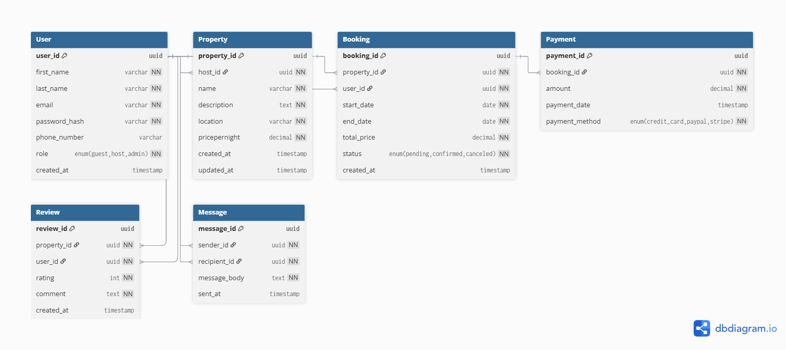

# ERD – Airbnb Database

This ERD models the core entities and relationships of an Airbnb-like system.

## Entities
- User
- Property
- Booking
- Payment
- Review
- Message

## Relationships (plain English)
- A User (host) owns many Properties.
- A User (guest) makes many Bookings.
- A Property has many Bookings.
- A Booking has one or more Payments.
- A Property has many Reviews.
- A User writes many Reviews.
- A User sends and receives many Messages.

## Diagram

